<h1 style="color:#1E90FF;">Reverse Engineering Writeups – Beginner Friendly</h1>

This repo contains beginner-friendly CTF writeups for the **Reverse Engineering** challenges hosted by **SECURINETS ISETR**.  
All challenges were authored by **DEXO**.

<h2 style="color:#1E90FF;">Challenges</h2>
<h3 style="color:#FF5347;">Challenge 1 </h3>
for the first challenge you're given an executable file called <a href="./challenges/7oumeni" style="color:#1E90FF;" download>7oumeni</a>.
so lets try running it into our Virutal Machine.  

To execute an EXE file in linux we just enter "./\<your file>\". 

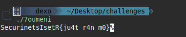

as you can see we found the flag 

<h3 style="color:#FF5347;">Challenge 2 </h3>
for the second challenge you're given another file called <a href='./challenges/t3ebt.aot' style="color:#1E90FF;" download>t3ebt</a>
 when we try to execute it we see this error 

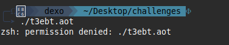

 this means we don't have the permission to actually execute this file.
 for this reason we're gonna use the "chmod" command with "+x" to make our file executable.

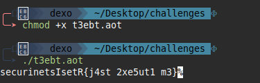

 and there comes our flag
<h3 style ="color:#FF5347;">Challenge 3 </h3>
for the 3rd challenge we're given a .png file called <a href="./challenges/strings.png" style="color:#1E90FF;" download>strings</a>
since its a png file we can use the "xdg-open" to open it but am a bit skeptical about it so am gonne use the "FILE" command to see if its really a png or another type.

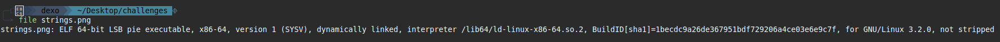  

And as you can see it turns out to be an executable
when we try to execute it asks for a password since we don't have any password or anything and the hint tells us to use the "strings" command along with the "grep" one we'll type this command

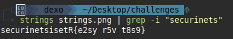

<h3 style ="color:FF5347;"> Challenge 4 </h3>
this task gives us a <a href="./challenges/check" style="color:#1E90FF;" download>check</a> executable and in the hint he tells us that the flag is the correct answer form our input. 
I can either use "strings" or just the online tools like https://dogbolt.org when i upload my file to dogbolt and i take the "binary ninja" decompiler's code it gives me this.

Its a simple C-like pseudocode.

Basically we have a string called FLAG123 and that string will be compared with our input if they both match then it gives me the correct message if not it says wrong.
so if we just enter FLAG123 in the check file input it gives us the "correct" message so our flag will be SecurinetsIsetR{FLAG123}

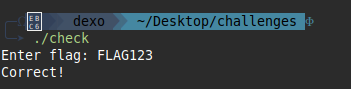

<h3 style ="color:FF5347;"> Challenge 5 </h3>
the 5th challenge called <a href="./challenges/arithm" style="color:#1E90FF;" download>arithm</a> tells us that the return value is our flag so this could be just a simple assembly math operations.  
while executing the exe file it gives no output let just see the its assembly code, i'll be using the linux command "objdump" with -d argument to disassemble my file to assembly language.

the math here is pretty easy. The program begins by loading four values into the registers: EAX = 16, EBX = 5, ECX = 3, and EDX = 2. It then performs a sequence of simple mathematical operations on EAX. First, it adds EBX to EAX (16 + 5 = 21), then subtracts ECX (21 − 3 = 18), and finally multiplies the result by EDX (18 × 2 = 36). The final value, 36, is moved into EBX before the program performs the system call.
so our flag will be **SecurinetsIsetR{36}**

<h3 style ="color:FF5347;"> challenge 6 </h3>
The challenge is called <a href="./challenges/notstrings" style="color:#1E90FF;" download>notstrings</a>.  

 

When i use the strings i see tens of SecurinetsIsetR flags but the catch is that only one of them is correct 
so am gonna use dogbolt again for this task.  

 as we can see in binary ninja the code just compares all the flags to just one flag if we keep searching we can see our flag right here
 SecurinetsIsetR{2e8d9b3fa1c54c9b8f79d7c9d10f42ea}

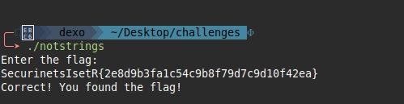

 <h3 style ="color :FF5347;"> challenge 7 </h3>
 this is a bit of a tough challenge actually its called <a href="./challenges/byte" style="color:#1E90FF;" download> byte </a>.  
 when we try and run it it gives this message

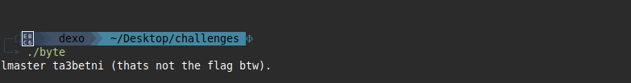

 am gonna use ghidra for this task since am used to it (you can use dogbolt or any decompiler you want).  
 
 

 When we see the Ghidra disassembled code, we immediately notice several MOV RAX, imm64 (immediate 64-bit value) instructions that load long constant values into local stack buffers. These constants clearly represent encrypted or encoded data, because the program places them sequentially in memory (local_28, local_20, local_35, local_3a) and even adds null terminators after each block. However, nowhere in the disassembly do we see any loop, XOR operation or arithmetic function that would actually use these bytes. The program never reads from these buffers again.  
 After writing all of this hidden data into the stack, the binary simply calls puts() to print a decoy message: 'lmaster ta3betni (thats not the flag)'. 
 Therefore, the key or decoding logic does not exist anywhere in the executable we are expected to extract the raw bytes from the constants and reverse the encoding manually, since the binary itself never performs the decryption.  
 Since the binary does not contain the XOR key, the only way to solve the challenge is to extract the encrypted bytes and brute‑force the key manually. From the Ghidra disassembly, we recover the following encrypted arrays (exactly as they appear in memory):  
 
 part1 = [0x69, 0x5F, 0x59, 0x4F, 0x48, 0x53, 0x54, 0x5F,0x4E, 0x49, 0x73, 0x49, 0x5F, 0x4E, 0x68, 0x41].  
 
 part2 = [0x69, 0x79, 0x0B, 0x6E, 0x6E, 0x0E, 0x68, 0x7F,0x0C, 0x65, 0x78, 0x0E].  
 
 part3 = [0x6E, 0x0B, 0x69, 0x47].  

now since we extracted all the encoded data we need to find the key the simplest way is to find which key gives us the letter "S" (the start of the SecurinetsISetR flag) from the endoded byte 0X69 using this python code

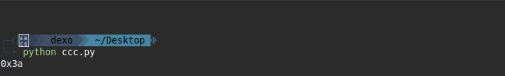

and we found our key which is 0X3A.  
now all thats left is to decode our bytes using that key as shown here in this simple python script .

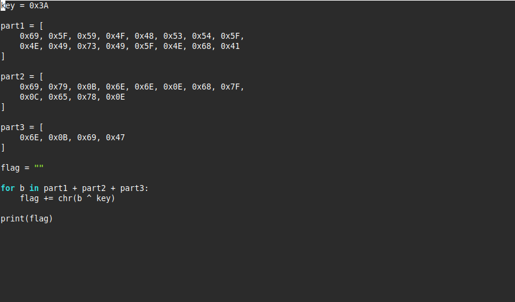

and here comes our flag SecurinetsIsetR{SC1TT4RE6_B4T1S}

<h3 style ="color :FF5347"> challenge 8 </h3>
This is the last challenge for the REV category called "The end of the line" the tasks provides a file called <a href="./challenges/dead" style="color:#1E90FF;" download> dead </a>.
when we try and expect it using ghidra disassembler again we see two functions one called "get key" and the other is the "main" function .

If we take a look at the decompiled "get_key" function we'll see return 0xA3 it looks like the key to our XOR encoded bytes 

if we try extracting our bytes and XORing them with the 0XA3 key we get this weird output (picture)

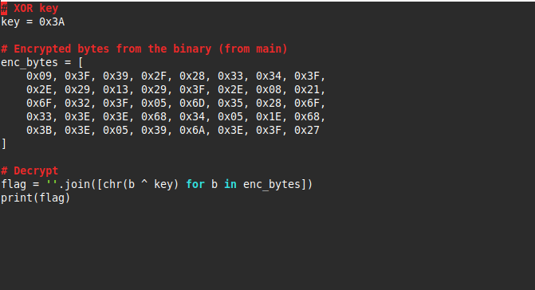

ye... i don't think this looks like a flag right?

and here comes the tricky part.  
 In the disassembly, the program hides the encrypted flag by loading it directly into the stack using multiple mov rax, imm64 and mov rdx, imm64 instructions. Each of these 64‑bit immediates actually contains eight encrypted characters, which together reconstruct the full ciphertext inside the stack frame. After loading all the bytes, the program performs a comparison on local_8c against a huge constant. Because this condition is always false, the decryption routine never executes. This “dead code” is intentionally placed to mislead anyone reversing the binary.

Even though the block is unreachable, inspecting it reveals the intended decryption logic: each encrypted byte is read from memory, XORed with a single‑byte key stored in local_91, and the result is written into another buffer. The loop continues until it encounters a null terminator. By extracting the encrypted bytes directly from the disassembly and applying the same XOR operation manually, we can recover the actual flag even though the program never prints it.

During analysis, the XOR key 0x3A initially looked promising because it produced fully printable output. However, the resulting text clearly did not form a valid flag, showing that 0x3A was a false positive. Because the key must be only one byte, we use a simpler approach: brute‑forcing all 256 possible XOR values (from 0x00 to 0xFF) until one of them produces a meaningful, properly‑formatted flag.
we can use this simple python script that tests every key possibility from 0X00 to 0XFF and only prints results that are fully ASCII printable

and bingo we get our flag  
SecurinetsIsetR{5he_7or5idd2n_D2ad_c0de}

